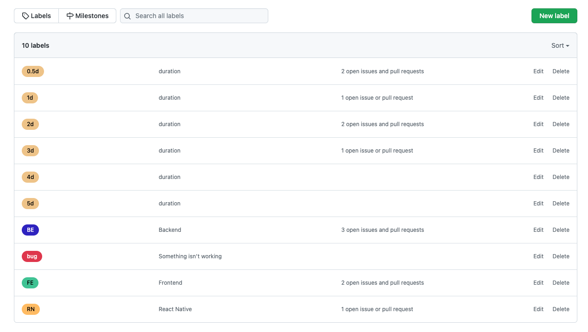
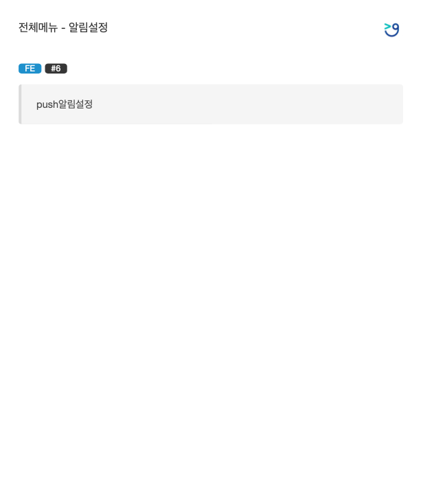

# Gitple Planning Butler

### Installation

- `yarn install`

### Prerequisites

1. create github [access token](https://docs.github.com/en/authentication/keeping-your-account-and-data-secure/creating-a-personal-access-token)
2. create `.env`, set TOKEN=stepOneAccessToken
3. Create labels in your github project, hour labels -> e.g.: `0.1d` ... `7d`, team labels -> e.g.: FE, RN, BE.
   One card should have one team label and hour added.
   
4. run `yarn setup`, then make sure your `config.json` file contains `teamLabels` configuration from step 3.

### Usage

1. run `yarn start`

### Output

#### Calculated hours for each team:

`src/files/hours.txt`

```

FE: 2.5
BE: 3.5
RN: 3

```

#### Generated Pdf File with Tasks (ready to print)

`src/files/output.pdf`


### Troubleshooting

- if you can't see some repositories during setup, double-check access token permissions in your github account: Settings > Developer Settings > Personal access tokens > YOUR TOKEN NAME
- if m1 air and showing "Error: spawn Unknown system error -86 at NotificationCenter.notifyRaw", then ```softwareupdate --install-rosetta```.
